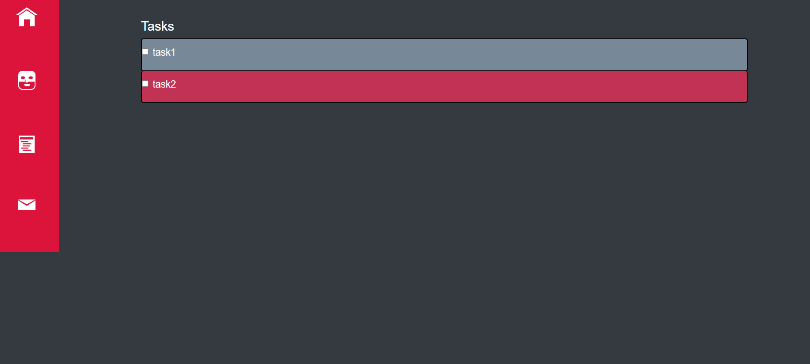
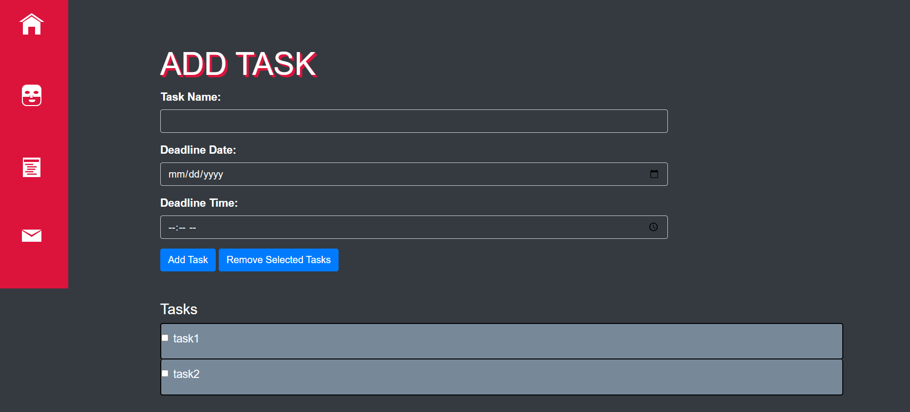
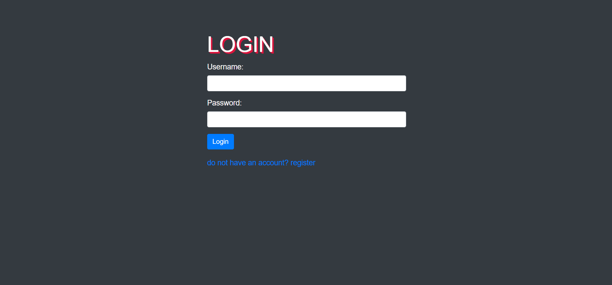
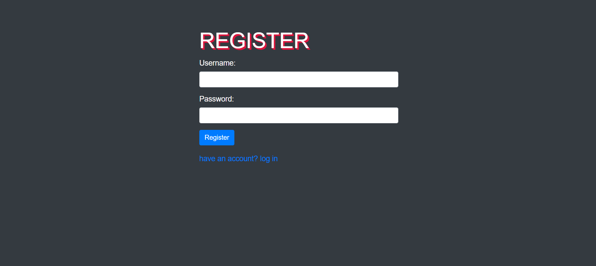
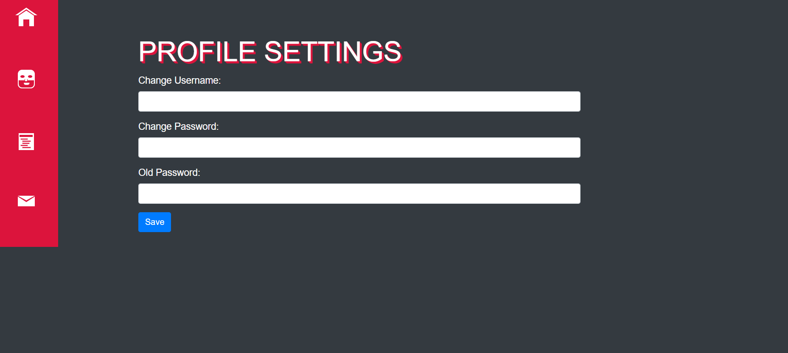
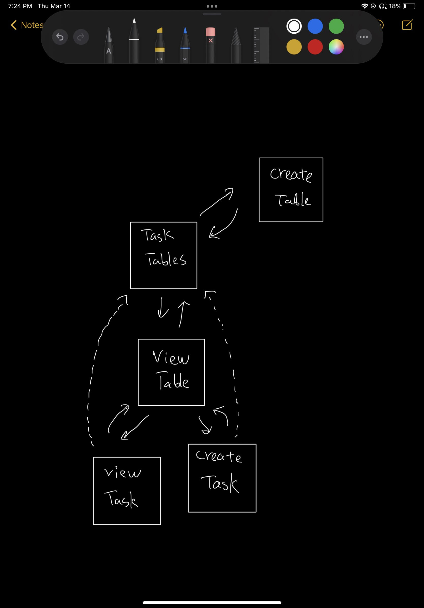

The content below is an example project proposal / requirements document. Replace the text below the lines marked "__TODO__" with details specific to your project. Remove the "TODO" lines.

(__TODO__: your project name)

# Task Tackler

## Overview

Being a college student, or even out of college, people always struggle with time management. We are constantly being bombarded with tasks to deal with.

Task Tackler is a web app that help you keep track of your personal tasks. Whether it is school work, doing your dirty laundrey, or buying groceries. Users can register and login. In their task tables, users can create new tasks. In each task, they can mark deadlines, create checklists, or even add collaboraters to existing tasks.

## Data Model 

The application will store Users, Task Tables, and Tasks

* users can have multiple Task Tables (via references)
* each Task Table will have multiple tasks (via references)

An Example User:

```javascript
{
  username: "mike1234",
  hash: // a password hash
  salt: // salt for password
}
```


An Example Task 
```javascript
{
  user: // a reference to a User object
  name : AIT homework6,
  deadline : 2024-3-21,
  createdAt: // timestamp
}
```

## [Link to Commented First Draft Schema](db.mjs) 

## Wireframes

/tasks

/tasks/add
/tasks/remove/selected

/auth/login

/auth/register

/auth/change-password
/auth/change-username



## Site map


## User Stories or Use Cases

1. as non-registered user, I can register a new account with the site
2. as a user, I can log in to the site
3. as a user, I can view all of the tasks I have created in a list
4. as a user, I can add tasks to an existing task list
5. as a user, I can remove tasks in an existing task list
6. as a user, I can view a task in a task table
7. as a user, I can search for tasks
8. as a user, I can update my username and password

## Research Topics

* (2 points) Use bootstrap 
    * I'm going to be using boostrap to make css styling easier
* (2 points) eslint
    * I've included eslint with gulp to monitor my code
* (6 point) Integrate user authentication
    * I'm going to be using passport for user authentication
    * Passport.js supports a wide range of authentication methods and provides a simple yet powerful API for authentication-related tasks.
    * Passport local mongoose makes serialization/deserialization easier


10 points total out of 10 required points

## [Link to Initial Main Project File](app.mjs) 

## Annotations / References Used
* navigation bar code: https://codepen.io/arjancodes/pen/VwpVqL

